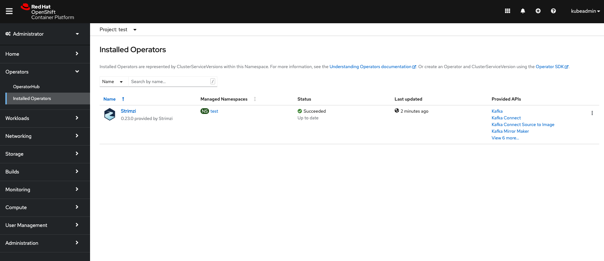
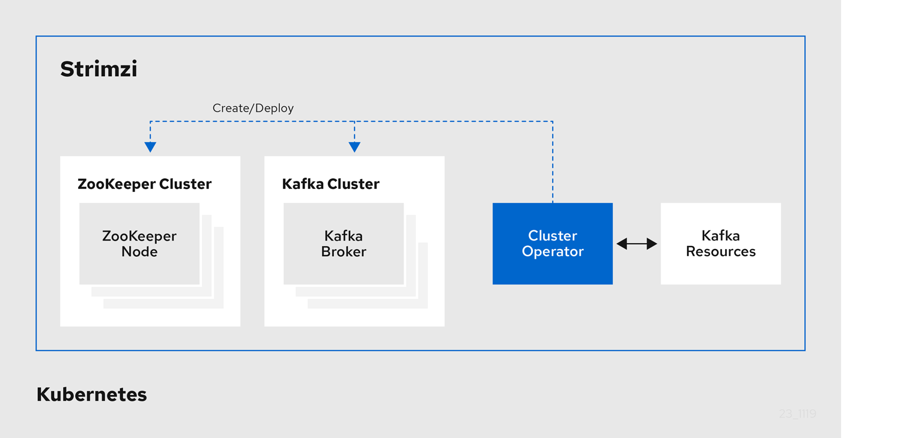

# Operator framework


## Prerequisites

Having completed the following labs:

- [00 - Prerequisites](../00-Prerequisites/README.md)
- [02 - Provision the environment](../02-Provision_the_environment/README.md)
- [03 - OKD login](../03-OKD_login/README.md)
- [04 - Project](../04-Project/README.md)

Having logged in using the **kubeadmin** account:

```console
$ oc login -u kubeadmin -p dpDFV-xamBW-kKAk3-Fi6Lg https://api.crc.testing:6443
Login successful.

You have access to 58 projects, the list has been suppressed. You can list all projects with 'oc projects'

Using project "test".
```

Make sure to use the **test** project.

```console
$ oc project test
Already on project "test" on server "https://api.crc.testing:6443".
```

## CRs, CRDs and Operators

A custom resource (CR) is an extension of the Kubernetes API that is not necessarily available in a default Kubernetes installation. It represents a customization of a particular Kubernetes installation

A Kubernetes Operator is an abstraction for deploying non-trivial applications on Kubernetes. It wraps the logic for deploying and operating an application using Kubernetes constructs. As an example, the Kafka operator provides a Kafka cluster as a first-class object.

Custom resource definitions (CRDs) extend the Kubernetes API, providing definitions to create and modify custom resources to a Kubernetes cluster. Custom resources are created as instances of CRDs.

CRDs require a one-time installation in a cluster. Depending on the cluster setup, installation typically requires cluster admin privileges.

CRDs and custom resources are defined as YAML files.

A CRD defines a new kind of resource, such as **kind: Kafka**, within a Kubernetes cluster.

Operators are implemented as a collection of controllers where each controller watches a specific resource type. When a relevant event occurs on a watched resource a reconcile cycle is started.

During the reconcile cycle, the controller has the responsibility to check that current state matches the desired state described by the watched resource.

## Using an operator for running Kafka on OpenShift

Install the operator

```console
$ oc apply -f strimzi_op.yaml 
subscription.operators.coreos.com/strimzi-kafka-operator created
```

To check if the operator has been installed successfully, wait until the PHASE changes into 'Succeeded' (it may take a while).


```console
$ oc get csv -n test
NAME                               DISPLAY   VERSION   REPLACES                           PHASE
strimzi-cluster-operator.v0.23.0   Strimzi   0.23.0    strimzi-cluster-operator.v0.22.1   Succeeded
```

Or inspect the status on  OpenShift Console



One or more CRD/s should have been created by the operator 

```console
$ oc get crd | grep  strimzi.io
kafkabridges.kafka.strimzi.io                                     2021-05-19T20:39:07Z
kafkaconnectors.kafka.strimzi.io                                  2021-05-19T20:39:06Z
kafkaconnects.kafka.strimzi.io                                    2021-05-19T20:39:09Z
kafkaconnects2is.kafka.strimzi.io                                 2021-05-19T20:39:10Z
kafkamirrormaker2s.kafka.strimzi.io                               2021-05-19T20:39:07Z
kafkamirrormakers.kafka.strimzi.io                                2021-05-19T20:39:06Z
kafkarebalances.kafka.strimzi.io                                  2021-05-19T20:39:07Z
kafkas.kafka.strimzi.io                                           2021-05-19T20:39:08Z
kafkatopics.kafka.strimzi.io                                      2021-05-19T20:39:06Z
kafkausers.kafka.strimzi.io                                       2021-05-19T20:39:07Z
```

If you want to inspect the CRD **kafkas.kafka.strimzi.io**:

```console
$ oc get crd kafkas.kafka.strimzi.io -o yaml | more 
apiVersion: apiextensions.k8s.io/v1
kind: CustomResourceDefinition
metadata:
  creationTimestamp: "2021-05-19T20:39:08Z"
  generation: 1
  labels:
    app: strimzi
    operators.coreos.com/strimzi-kafka-operator.test: ""
    strimzi.io/crd-install: "true"
  managedFields:
  - apiVersion: apiextensions.k8s.io/v1
    fieldsType: FieldsV1
    fieldsV1:
      f:metadata:
        f:labels:
          .: {}
          f:app: {}
          f:strimzi.io/crd-install: {}
      f:spec:
        f:conversion:
          .: {}
          f:strategy: {}
        f:group: {}
        f:names:
          f:categories: {}
          f:kind: {}
          f:listKind: {}
          f:plural: {}
          f:shortNames: {}
          f:singular: {}
        f:scope: {}
        f:versions: {}
      f:status:
        f:acceptedNames:
```

Now, we are going to implement the following architecture:



To test the operator, we are ready to create a **Kafka** resource, note the `kind: Kafka`

```yaml
apiVersion: kafka.strimzi.io/v1beta2
kind: Kafka
metadata:
  name: my-kafka-cluster-with-operator
spec:
  kafka:
    replicas: 1
    ...
```

```console
$ oc apply -f kafka-cluster.yaml 
kafka.kafka.strimzi.io/my-kafka-cluster-with-operator created
```

Note that since we installed the operator and its CRDs successfully, we can **get kafka** cluster using oc tool

```console
$ oc get kafka
NAME                             DESIRED KAFKA REPLICAS   DESIRED ZK REPLICAS   READY   WARNINGS
my-kafka-cluster-with-operator   1                        1                     1        
```

Get the Kafka pod list:

```console
$ oc get pods

```

You can delete the cluster now:

```console
$ oc delete -f .               
kafka.kafka.strimzi.io "my-kafka-cluster-with-operator" deleted
```